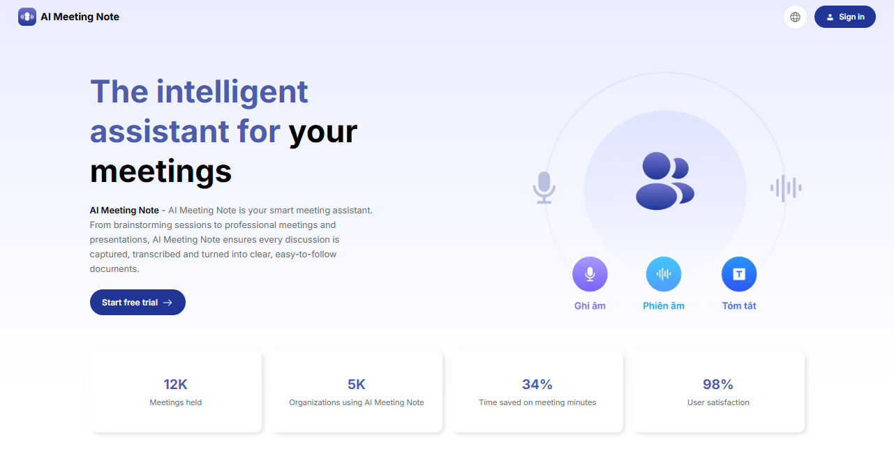
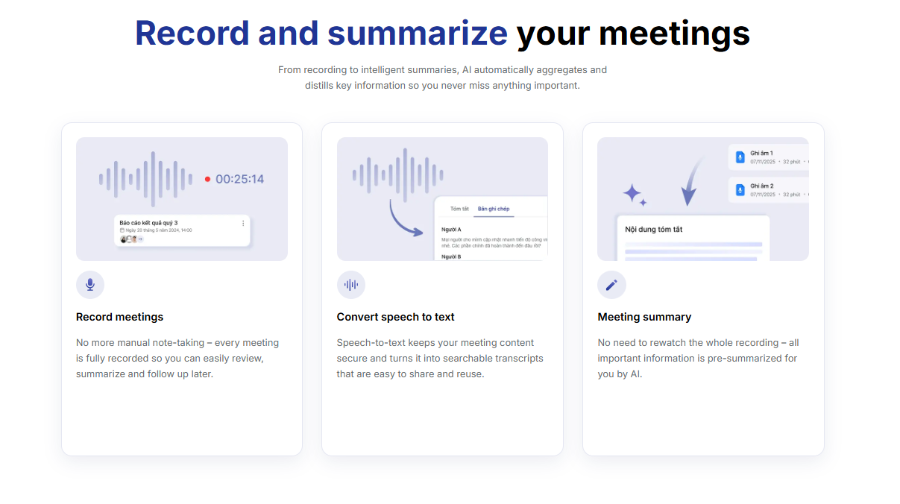
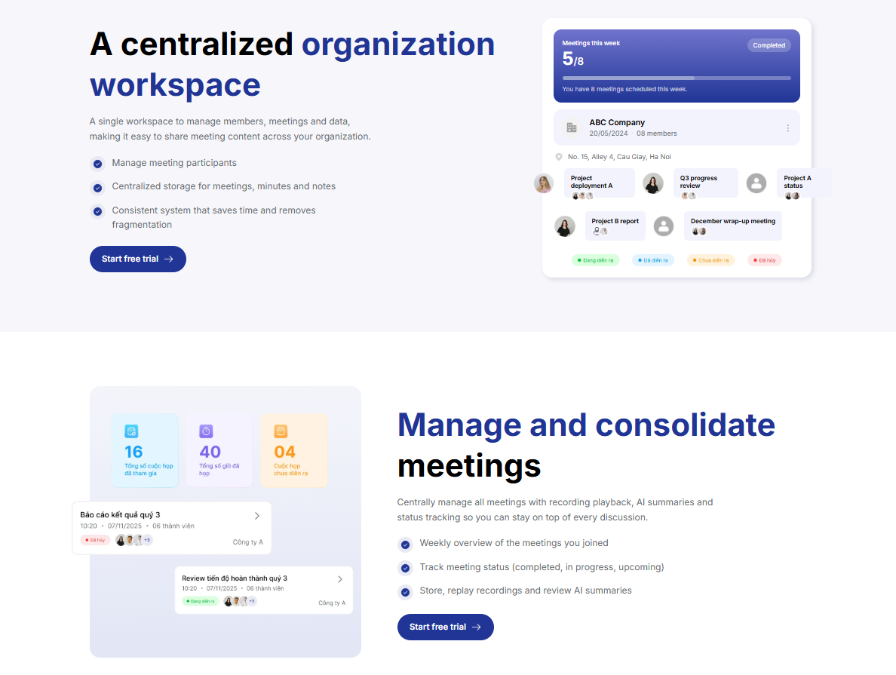
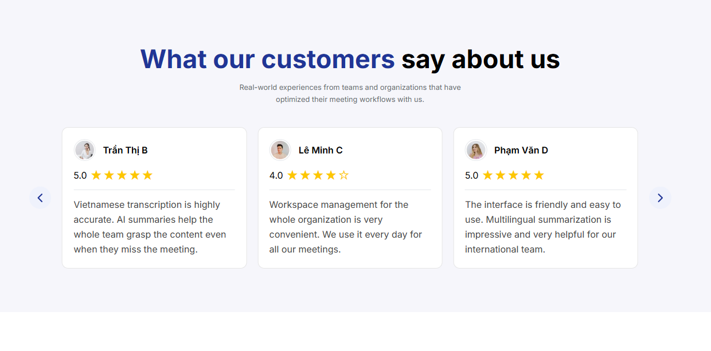
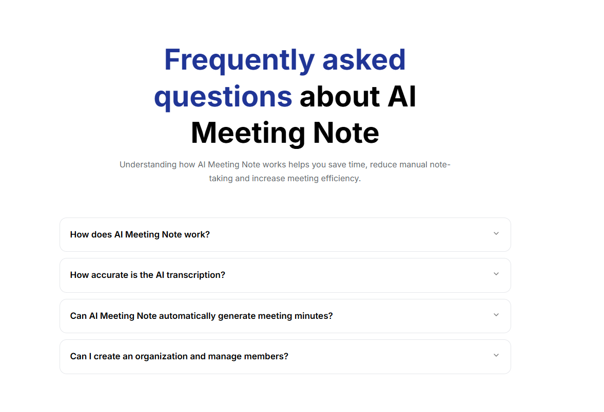
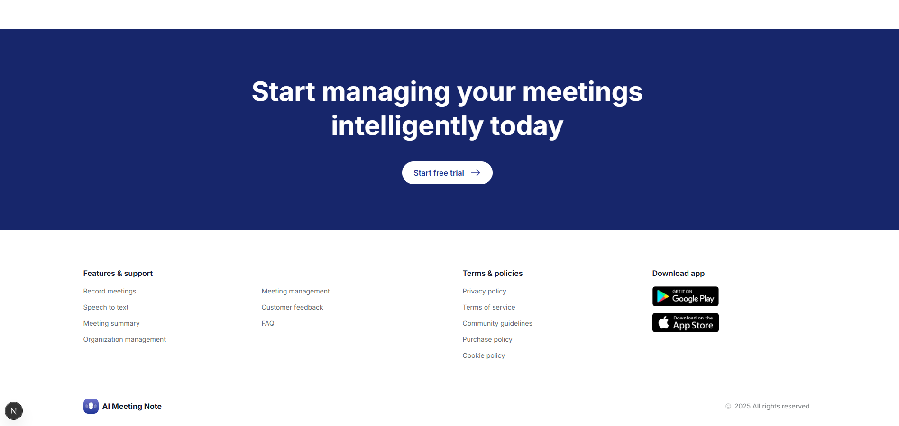

# 🚀 AI Meeting Webview

Một nền tảng **Webview hỗ trợ trải nghiệm họp trực tuyến tích hợp AI**, được xây dựng với **Next.js** nhằm tối ưu hiệu năng, khả năng mở rộng và trải nghiệm người dùng hiện đại.

---
# 🔗 **Trải nghiệm dự án**

**Vercel:** https://ai-meeting-webview.vercel.app/vi

--- 

## 🧰 Tech Stack

**Framework:** Next.js (App Router)
**Language:** TypeScript
**UI Styling:** Tailwind CSS
**Internationalization:** next-intl
**Architecture:** Component-based architecture

---

## 🌐 Project Overview

Dự án được thiết kế nhằm cung cấp **giao diện Webview nhẹ, nhanh và tối ưu** cho các hệ thống họp trực tuyến tích hợp AI.

### 🎯 Mục tiêu

* Tạo giao diện webview **nhẹ và nhanh**
* Hỗ trợ **đa ngôn ngữ (i18n)**
* Thiết kế **UI hiện đại và tối giản**
* Tối ưu hiệu năng khi chạy trong **Webview môi trường mobile/app**

Ngoài ra, hệ thống còn được thiết kế để **mở rộng dễ dàng cho các tính năng AI trong tương lai**.

---

## 📸 Demo Interface
### Homepage

  

### Features Section

  

### Statistics Section

  

### Testimonials Section

  

### FAQ Section

  

### Footer

  

